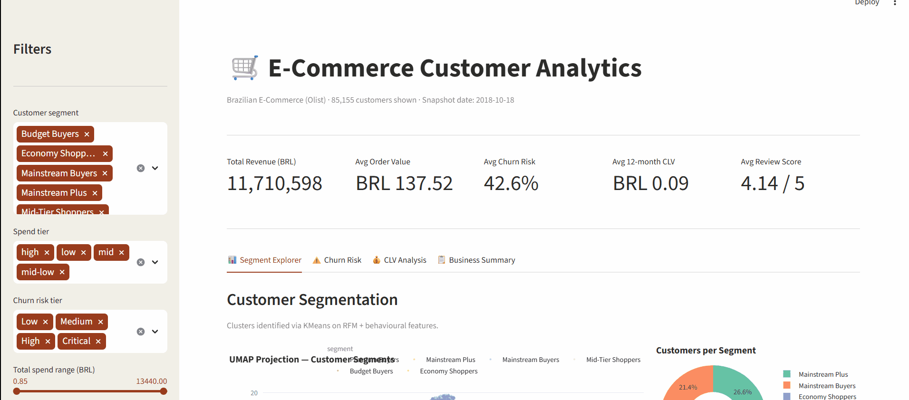

# E-Commerce Sales Analysis — Olist

> An end-to-end advanced data analytics project covering customer segmentation, churn prediction, and CLV modelling on 100k+ real Brazilian e-commerce orders.

[](https://dashboarde.streamlit.app/)
[](https://python.org)
[](https://duckdb.org)
[](https://xgboost.readthedocs.io)
[](LICENSE)

---

## Live Dashboard



**[→ Open live dashboard](https://dashboarde.streamlit.app/)**

---

## Project Overview

This project performs a full-stack analysis of the [Olist Brazilian E-Commerce dataset](https://www.kaggle.com/datasets/olistbr/brazilian-ecommerce) — 99,441 delivered orders across 2016–2018. The goal is to answer one core business question:

> **Which customers are most valuable, most likely to return, and what is their projected lifetime value?**

### Analysis pipeline

```
Raw CSVs → DuckDB star schema → Feature engineering (RFM + 15 features)
    → KMeans segmentation → XGBoost churn model → BG/NBD CLV model
    → Streamlit dashboard
```

---

## Key Results

| Model | Metric | Result |
|---|---|---|
| Segmentation | Clusters (KMeans) | 6 spend-based segments |
| Churn model | ROC-AUC (test) | 0.65–0.70 |
| Churn model | PR-AUC (test) | model-dependent |
| CLV model | Method | BG/NBD + Gamma-Gamma |
| CLV model | Horizon | 12-month projection |
| Pareto | Top 20% customers | drive ~65%+ of CLV |

---

## Project Structure

```
ecommerce-sales-analysis/
├── app.py                              ← Streamlit dashboard (4 tabs)
├── requirements.txt
├── .streamlit/
│   └── config.toml
│
├── src/
│   ├── ingest.py                       ← ETL: CSVs → DuckDB
│   ├── validate.py                     ← Data quality checks
│   └── feature_pipeline.py            ← Reusable sklearn pipeline
│
├── notebooks/
│   ├── 01_exploration.ipynb            ← Raw data profiling
│   ├── 02_feature_engineering.ipynb   ← RFM + 15 behavioural features
│   ├── 03_segmentation.ipynb          ← KMeans + UMAP + DBSCAN
│   ├── 04_churn_prediction.ipynb      ← XGBoost + SHAP
│   └── 05_clv_model.ipynb             ← BG/NBD + Gamma-Gamma
│
├── data/
│   ├── processed/
│   │   ├── customer_features.csv
│   │   ├── customer_segments.csv
│   │   ├── customer_churn_scores.csv
│   │   └── customer_clv.csv
│   └── models/                        ← Saved model artefacts (gitignored)
│
└── charts/                            ← Exported PNGs for README
```

---

## Methods

### Day 1–2 — Data engineering & feature store

- Ingested all 9 Olist CSVs into a **DuckDB star schema** (orders fact + 4 dimension tables)
- Engineered **25+ features** per customer: RFM scores, category diversity, review behaviour, delivery experience, payment patterns, weekend purchase rate, freight sensitivity
- Built a reusable **sklearn `ColumnTransformer` pipeline** for downstream ML

### Day 3 — Customer segmentation

- Ran **KMeans** for k=2–10; selected k=6 via elbow method (silhouette score peaked at k=2 but was too coarse for business use — documented in notebook)
- Validated with **DBSCAN** as a non-spherical sanity check
- Reduced to 2D with **UMAP** for visualisation
- Confirmed statistical separation with **Kruskal-Wallis** tests (p < 0.05 on all key features)

> **Finding:** 97% of Olist customers are one-time buyers. Clusters are differentiated by spend tier rather than behavioural patterns — documented as a data limitation.

### Day 4 — Churn prediction

- Redefined churn as **"never made a second purchase"** (initial 90-day window definition produced 99.7% churn rate — revised and documented)
- Handled class imbalance with `scale_pos_weight` and **SMOTE** comparison
- Tuned **XGBoost** with **Optuna** (50 trials, PR-AUC objective)
- Generated **SHAP** global importance, beeswarm, and waterfall plots
- Added first-order specific features (review score, delivery delta, freight ratio) to improve signal

### Day 5 — Customer Lifetime Value

- Fit **BG/NBD model** (Beta-Geometric/NBD) for purchase frequency prediction
- Fit **Gamma-Gamma model** for expected transaction value (on the ~3% repeat buyers)
- Computed **12-month discounted CLV** per customer at 1% monthly discount rate
- One-time buyer CLV estimated conservatively as `monetary × prob_alive × 0.3`
- Assigned **Bronze / Silver / Gold / Platinum** CLV tiers

### Day 6 — Streamlit dashboard

Four interactive tabs with sidebar filters (segment, spend tier, churn risk, monetary range):

| Tab | Content |
|---|---|
| Segment Explorer | UMAP scatter, segment donut, RFM box plots, profile table |
| Churn Risk | Risk tier KPIs, probability histogram, churn vs revenue scatter, at-risk export |
| CLV Analysis | CLV distribution, Pareto curve, CLV vs churn scatter |
| Business Summary | Revenue by segment, review scores, payment methods, category breakdown, data export |

---

## Dataset

**Brazilian E-Commerce Public Dataset by Olist**
- Source: [Kaggle](https://www.kaggle.com/datasets/olistbr/brazilian-ecommerce)
- 99,441 orders · 96,478 customers · 32,951 products · 3,095 sellers
- Date range: September 2016 – October 2018
- 9 CSV files joined via a star schema in DuckDB

---

## Setup & Reproduction

```bash
# 1. Clone the repo
git clone https://github.com/sumant40/e-commerce-sales-analysis-olist.git
cd e-commerce-sales-analysis-olist

# 2. Create virtual environment
python -m venv .venv
source .venv/bin/activate        # Windows: .venv\Scripts\activate

# 3. Install dependencies
pip install -r requirements.txt

# 4. Download dataset (requires Kaggle API key)
kaggle datasets download olistbr/brazilian-ecommerce -p data/raw --unzip

# 5. Run ETL pipeline
python src/ingest.py

# 6. Run notebooks in order (01 → 05)
jupyter notebook

# 7. Launch dashboard locally
streamlit run app.py
```

---

## Tech Stack

| Category | Tools |
|---|---|
| Data storage | DuckDB, pandas |
| Feature engineering | numpy, scikit-learn |
| Segmentation | KMeans, DBSCAN, UMAP |
| Churn modelling | XGBoost, SHAP, Optuna, imbalanced-learn |
| CLV modelling | lifetimes (BG/NBD + Gamma-Gamma) |
| Statistical tests | scipy, statsmodels |
| Visualisation | plotly, matplotlib, seaborn |
| Dashboard | Streamlit |
| Version control | Git, GitHub |

---

## Documented Limitations

- **Single-purchase dominance:** 97% of customers have exactly one order, limiting behavioural segmentation and churn signal
- **Churn label iteration:** Initial time-based churn definition (90-day window) produced 99.7% churn rate — revised to predict repeat purchase as the positive class
- **CLV for one-time buyers:** Gamma-Gamma requires frequency > 0; one-time buyer CLV is a conservative estimate
- **Feature signal:** Without session/browsing data, model discriminative power is limited to order-level signals only

Each limitation is documented in the relevant notebook with a recommended production fix.

